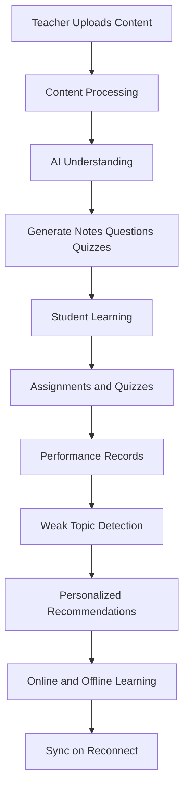
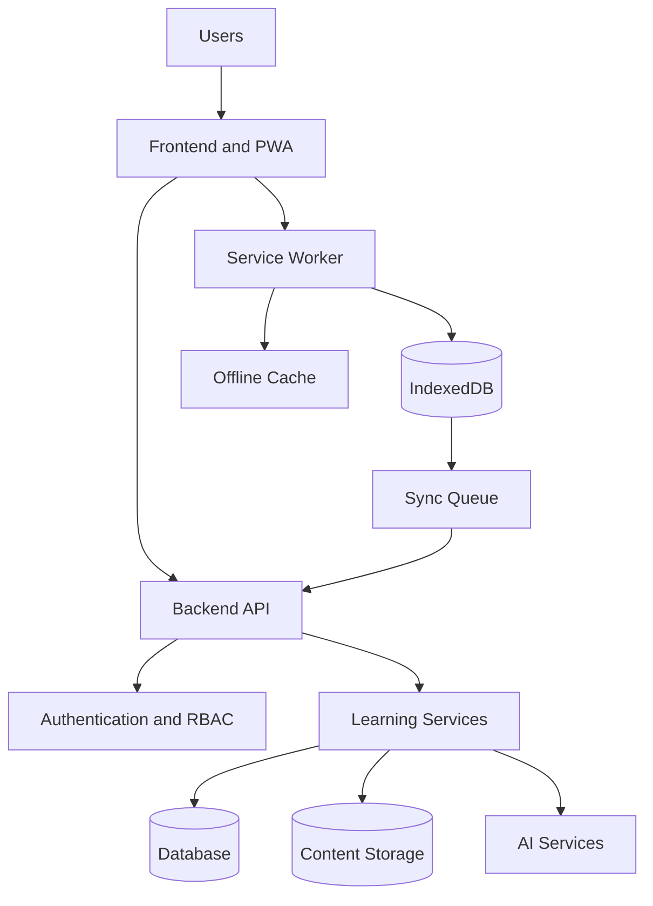
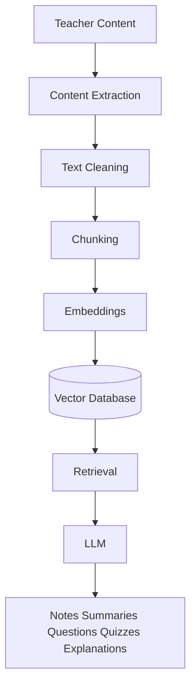
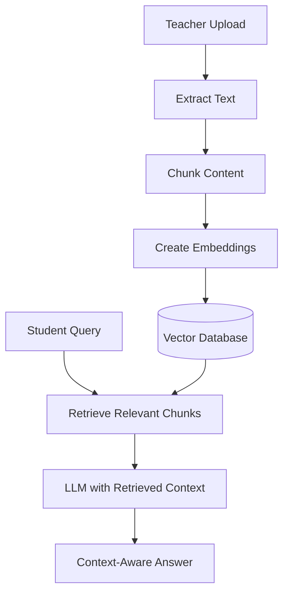
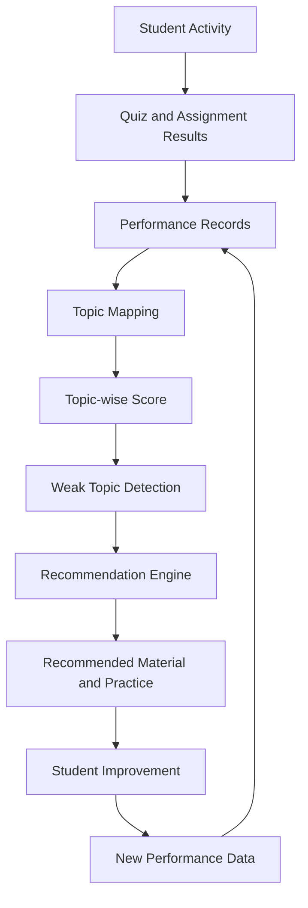
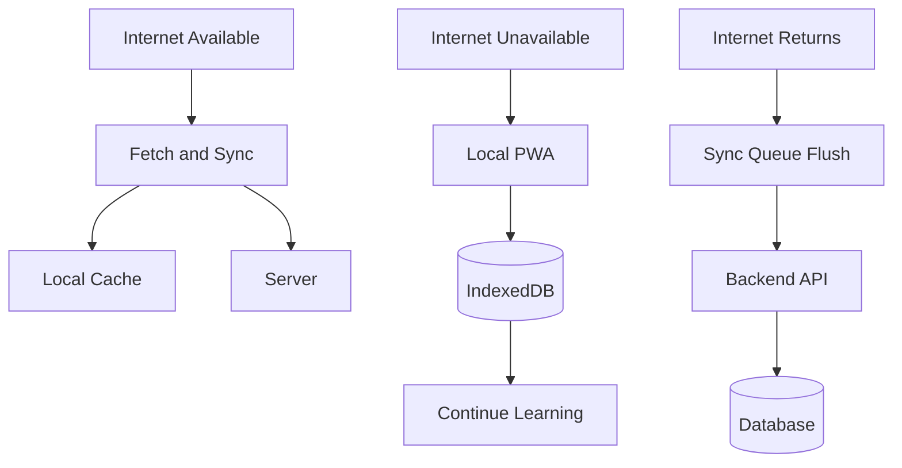
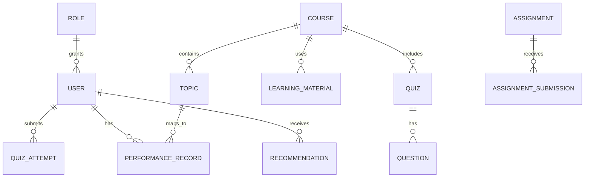

# PROJECT_ARCHITECTURE

## 1. Project Overview

- Project name: AI-Powered Offline-First Learning Platform (Hackathon)
- One-line description: A digital learning platform concept for low-connectivity environments that combines offline access with AI-assisted learning support.
- Target users: Students, teachers, and educational institutions
- Core problem: Learning continuity and personalized support are difficult when internet is unstable and academic workflows are fragmented.
- Core solution: A unified platform with offline-first learning, AI content intelligence, assessment analytics, and personalized recommendations.
- Key innovation: Combining offline-first architecture with AI-driven content generation and topic-level performance guidance in one workflow.

## 2. Problem Statement

### 2.1 Digital Education Gap

In many parts of India, especially rural and low-connectivity regions, internet access is inconsistent. Students can attend class but may not be able to reliably continue digital learning afterward. This creates unequal access to revision, practice, and academic support.

### 2.2 Classroom Dependency

Learning often remains tied to classroom hours. After class, students may not have structured access to notes, practice questions, quizzes, revision plans, or clarified explanations. When continuity breaks after class, understanding drops over time.

### 2.3 Fragmented Learning Resources

Learning materials are often spread across multiple channels such as PDFs, messaging apps, video links, separate portals, and personal notes. This fragmentation makes retrieval slow and inconsistent for both students and teachers.

### 2.4 Lack of Personalized Learning

Students learn at different speeds and struggle with different topics. Many traditional flows deliver similar content to everyone, which often misses individual weak areas and does not provide clear next-step recommendations.

### 2.5 Teacher Workload

Teachers spend significant time converting raw teaching material into structured notes, practice questions, quizzes, and revision resources. Manual academic content preparation reduces time available for direct mentoring.

### 2.6 Performance Analysis Problem

At scale, manually analyzing assignments, quizzes, and topic-level outcomes is difficult. Without consistent topic mapping and analytics, identifying weak areas and timely intervention becomes harder.

### 2.7 Core Problem

How can we provide continuous, personalized learning in low-connectivity environments while reducing teacher preparation effort and enabling measurable, topic-level learning interventions?

## 3. Why Existing Approaches Are Not Enough

- Traditional classroom-first learning is strong for direct teaching, but typically limited by class-time boundaries.
- Many online platforms improve access, but often assume stable internet.
- Basic LMS platforms usually organize courses and files well, but often do not provide deep topic-level personalization.
- Generic AI chatbots can help with explanations, but without grounding in course content and performance context, outputs may be less reliable for formal learning.

A combined approach is needed:
- Offline-first continuity
- Centralized academic workflows
- Grounded AI generation and retrieval
- Performance analytics linked to recommendations

## 4. Proposed Solution

### Simple View
 
We propose an AI-powered, offline-first learning platform that connects teachers, students, educational content, assessments, and personalized recommendations into one continuous learning ecosystem.
 
The solution is designed around one core idea: **teachers provide the content, AI transforms it into useful learning resources, students learn and practice, the system analyzes their performance, and AI recommends what they should learn next — even when internet connectivity is unavailable.**

#### The solution is designed around one core idea:
Teachers provide the content, AI transforms it into useful learning resources, students learn and practice, the system analyzes their performance, and AI recommends what they should learn next — even when internet connectivity is unavailable.

### Technical View
 
The platform combines eight cooperating layers:
 
1. **Content management** — a single canonical store per course/topic, replacing scattered PDFs/links/notes.
2. **AI content understanding** — extraction, cleaning, and chunking of raw teacher material into a structured, queryable form.
3. **AI generation of notes/questions/quizzes** — turning that structured content into ready-to-use learning assets automatically.
4. **Student learning and assessments** — the interface where students consume material and attempt quizzes/assignments.
5. **Topic-level performance analysis** — mapping every attempt back to a topic, not just an overall score.
6. **Weak-topic detection** — surfacing exactly which topics a student is underperforming in.
7. **Recommendation engine** — converting weak-topic signals into a specific, ordered next action.
8. **Offline storage and background sync** — keeping the whole loop functional without a live connection, then reconciling once one returns.

### Direct Problem → Solution Mapping

### Why This Combination, Specifically
 
- **Offline-first alone** would fix connectivity but not workload or personalization — students could study offline, but content would still be manually produced and generic.
- **AI generation alone** would fix teacher workload but not continuity — content could be produced quickly but still be unreachable without a connection.
- **A recommendation engine alone** would fix personalization but not the underlying data problem — without topic mapping, there's nothing reliable to recommend from.
The platform's value comes from making these reinforce each other: AI-generated content is what gets cached offline; performance from offline attempts is what feeds the recommendation engine once synced; and topic-level tagging is what makes both the generation and the analytics meaningful rather than generic.
 
---
## 5. Key Features
 
- Offline-first learning
- Teacher content upload and management
- AI-generated notes, questions, and quizzes
- Topic-level weak-area detection
- Personalized recommendations
- Student performance tracking
- Semantic search over learning content
- Centralized learning resources
- Offline synchronization
- Teacher analytics and student dashboards
---

## 6. Solution Workflow

Teacher
↓
Content Upload
↓
Content Processing
↓
AI Understanding
↓
Notes / Questions / Quiz Generation
↓
Student Learning
↓
Assessment
↓
Performance Tracking
↓
Topic Analysis
↓
Weak Topic Detection
↓
Recommendation Engine
↓
Personalized Learning
↓
Offline Support
↓
Synchronization

Stage summary:
- Content upload and processing prepare clean educational input.
- AI modules generate learning assets and support assessments.
- Assessment and activity generate measurable signals.
- Topic analytics drive weak-area detection and recommendations.
- Offline + sync preserve continuity in low-connectivity contexts.

## 7. System Architecture

Architecture notes:
- Users interact through frontend/PWA.
- Backend API coordinates auth and learning services.
- Learning services connect to database, content storage, and AI services.
- Service worker manages caching, local data, and sync queue behavior.

## 8. AI Architecture

Why embeddings and vector retrieval help:
- Embeddings map similar educational text close together in vector space.
- Vector search retrieves the most relevant chunks for a query.
- Retrieval gives the model grounded context from course material, improving relevance for academic outputs.

## 9. RAG Architecture

RAG flow:
1. Teacher uploads educational content.
2. Content is extracted.
3. Content is split into chunks.
4. Embeddings are generated.
5. Embeddings are stored in a vector database.
6. Student asks a question or requests learning support.
7. Relevant chunks are retrieved.
8. Retrieved context is sent to the LLM.
9. LLM returns a context-aware response.

RAG benefit:
- The AI answers using course-provided context instead of relying only on broad pretraining knowledge.

## 10. Personalized Learning Architecture

Personalization should be signal-driven, not guess-driven.

Design principle:
- Recommendations are generated from measurable outcomes such as attempts, scores, and topic mastery trends.

## 11. Offline-First Architecture

Key elements:
- Service worker for caching and background sync orchestration
- Local cache for quick asset access
- IndexedDB for offline activity data
- Sync queue for deferred API writes
- Reconciliation after reconnect

## 12. Data Flow

### Standard LMS Data Flow

User
↓
Frontend
↓
API
↓
Authentication
↓
Business Logic
↓
Database
↓
Response
↓
Frontend

### AI Data Flow

Content / Performance Data
↓
AI Processing
↓
Analysis / Generation
↓
Learning Output
↓
Student / Teacher

## 13. Conceptual Database Model

This is a conceptual data model, not a published physical schema.

High-level relationship view:
- Users have roles and interact with courses.
- Courses include materials, quizzes, and assignments.
- Attempts and submissions feed performance records.
- Recommendations are generated from performance and topic mapping.

## 14. Technology Stack

No implementation stack files are present in the current repository snapshot. The table below is the planned stack direction.

| Layer | Technology | Purpose |
|---|---|---|
| Frontend | React + Vite (PWA) | Student/teacher web experience, installable and offline-capable |
| Backend | Node.js backend service | API and business logic |
| Caching | Redis | Fast access to frequently used / temporary data, reduces DB load |
| Database | PostgreSQL | Structured application data (users, courses, quizzes, attempts, performance) |
| Vector search | pgvector (PostgreSQL extension) | Stores embeddings alongside app data, enables semantic search |
| Embeddings | Text embedding model | Converts educational content into vector representations |
| AI generation | LLM (fast + capable model tiers) | Content generation, analysis, and recommendations |
| Offline | Service Worker + IndexedDB | Local caching, offline activity storage, background sync |

## 15. Technical Challenges and Solutions

| Challenge | Why it happens | Proposed solution | Expected result |
|------|------|------|------|
| Poor internet connectivity | Unstable network in target regions | Offline-first client with local persistence and deferred sync | Continuous learning during outages |
| Large learning content | Long documents and mixed formats | Chunking, indexing, and retrieval layers | Faster and more relevant learning outputs |
| AI hallucination risk | Model can answer without grounded context | RAG with course-content retrieval and confidence gates | Better relevance and fewer unsupported answers |
| Content retrieval quality | Keyword-only search misses context | Embeddings + vector retrieval | Semantically relevant retrieval |
| Teacher workload | Manual creation of notes/questions/quizzes | AI-assisted generation pipeline | Reduced repetitive preparation work |
| Weak-topic detection | Raw scores are not enough | Topic mapping + mastery scoring | Actionable weak-topic insights |
| Personalization quality | Generic recommendations are ineffective | Performance-driven recommendation engine | Better targeted learning plans |
| Offline data synchronization | Conflicts and delayed writes | Sync queue, idempotent writes, reconciliation rules | Improved reliability after reconnect |
| Data consistency | Online and offline updates may diverge | Versioning and conflict-resolution policy | Consistent learner records |

## 16. AI Safety and Reliability

- Ground AI responses in uploaded educational content via retrieval.
- Use RAG-based context injection for academic answers.
- Validate structured outputs for quiz and question formats.
- Include teacher review for generated learning content before high-stakes use.
- Avoid unsupported recommendations when confidence is low.
- Return safe fallback responses when context is insufficient.
- Protect student data through access controls and secure handling.

## 17. Scalability

The architecture can scale through:
- Institution-level multi-tenant separation
- Horizontal API scaling
- Asynchronous AI processing queues
- Database indexing for activity and performance queries
- Vector index partitioning for large content sets
- Object/content storage expansion for documents and media
- Queue-based sync processing for high offline event volume

## 18. Security

Security design targets:
- Authentication and session/token management
- Role-based access control
- API authorization checks per role and resource
- Secure file/content access policies
- Input validation and sanitization
- Student data protection and least-privilege principles
- Environment-variable based secret handling
- Rate limiting where appropriate

Implementation note:
- Security architecture is defined, but repository-level implementation artifacts are not currently present.

## 19. Implementation Status
 
*Status is based only on this repository snapshot.*
 
- Architecture documentation 
- Problem analysis and solution definition
- System architecture design
- AI architecture and RAG design
- Personalized learning architecture design
- Offline-first architecture design
- Frontend application code
- Backend API code
- Authentication and RBAC implementation
- Content management implementation
- AI generation implementation
- Topic-level analytics implementation
- Recommendation engine implementation
- PWA/service worker implementation
- IndexedDB offline storage implementation
- Sync queue implementation
---

## 20. Future Scope

- Advanced AI tutor for guided concept remediation
- Multilingual learning support
- Voice-based learning interactions
- Advanced predictive analytics for risk detection
- Adaptive learning paths with continuous mastery updates
- More sophisticated recommendation models
- Institution-level analytics dashboards

All items above are future scope and not claimed as implemented in this repository snapshot.

## 21. Expected Impact

### Students
- Better continuity of learning in unstable network conditions
- More personalized revision support based on measurable performance
- Easier access to structured learning resources

### Teachers
- Reduced manual preparation effort
- Better visibility into weak topics and progress trends
- Faster assessment and intervention cycles

### Institutions
- Improved academic visibility across learners and courses
- Unified learning ecosystem design
- Better support planning for low-connectivity education contexts

## 22. Final Summary

This project targets a real intersection of educational constraints:

LOW CONNECTIVITY
+
TEACHER WORKLOAD
+
LACK OF PERSONALIZATION
+
FRAGMENTED LEARNING RESOURCES

The proposed architecture addresses these through:

OFFLINE-FIRST LEARNING
+
AI CONTENT INTELLIGENCE
+
PERFORMANCE ANALYTICS
+
PERSONALIZED RECOMMENDATIONS

In the current repository, architecture and solution design are documented; implementation modules are tracked as in development or planned.
